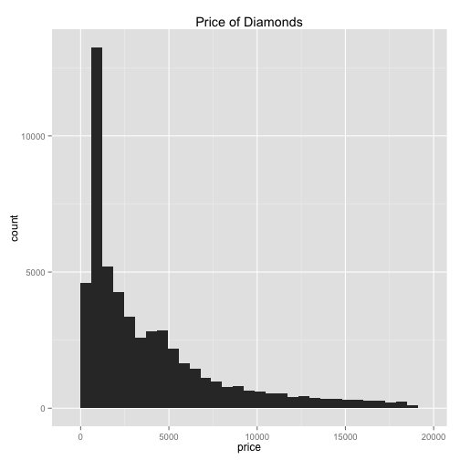

A Grammar of Graphics
========================================================
author: Albert Y. Kim
date: Monday 2015/01/26

Starting Point: Data Frames
========================================================
We set the restriction that all our data exists in a matrix called a **data frame**, which we say has the "tidy" property:

What is a statistical graphic?
========================================================
[Wilkinson (2005)](http://link.springer.com/book/10.1007/0-387-28695-0/page/1) boils it down:

In brief, the grammar tells us that a statistical graphic is a mapping from **data** to **aesthetic** attributes (color, shape, size) of **geometric** objects (points, lines, bars).

Example: Napolean's March on Moscow
========================================================
Famous graphical illustration by Minard of Napolean's march to and retreat from Moscow in 1812

The Grammar
========================================================
Data (Variable)  | Aesthetic | Geometric Object
------------- | ------------- | -------------
longitude | | points
latitude | | points
army size | size = width | bars
army direction | color = brown or black | bars
date | | text
temperature | | lines

The Grammar
=========================================================
The plot may also contain **statistical transformations** of the data.  Ex: histograms transform numbers into counts that fall into bins

 

Basic Components
========================================================
* **`aes`** mappings of data to _aesthetics_ we can perceive on a graphic: x/y position, color, size, and shape. Each aesthetic can be mapped to a variable in our data set.  If not assigned, they are set to defaults.
* **`geom`** geometric objects: type of plot: points, lines, bars, etc.
* **`stat`** statistical transformations to summarise data: smoothing, binning values into a histogram, or just itself "identity"

More Components
========================================================
* **`facet`** how to break up data into subsets and display broken down plots
* **`scales`** both
    + convert **data units** to **physical units** the computer can display
    + draw a legend and/or axes, which provide an inverse mapping to make it possible to read the original data values from the graph.
* **`coord`** coordinate system for x/y values: typically cartesian.
* **`position`** adjustments
* **Extras** titles, axes labels, themes

Exercise
========================================================
Open `ggplot.R` in RStudio and do examples.

Further Reading Ressources
========================================================
* Help files.  Ex `?geom_line()`
* Online help files: [http://docs.ggplot2.org/current/](http://docs.ggplot2.org/current/)
* [Ultimate Tech Support](http://xkcd.com/627/)

* ggplot2 book is on Moodle.  To learn more, I suggest reading
    + Chapter 1,
    + Chapter 3, but it will be hard to grasp the first time
    + Chapter 4
    + Revisit Chapter 3. Chapters  5-10 go into specific details.
* The code for all examples in the book: [http://ggplot2.org/book/](http://ggplot2.org/book/)

