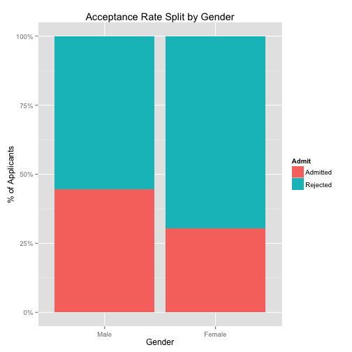

Wrapping Up ggplot + Grammar of Data Manipulation
========================================================
author: Albert Y. Kim
date: Friday 2015/01/30


Questions from Last Time
========================================================
What up with the `geom_bar(stat = "identity")` code from last time?

The default `stat` for bar plots is "bin".  Meaning if the data are already binned,
we don't want to re-bin them again, so we set `stat="identity"` meaning take the numbers as
they are.

See R code.


qplot
========================================================
The `qplot()` command (Chapter 2 in ggplot text) describes a way to make "quick" plots, such as simple histograms and scatterplots.

It's built using all the grammar of graphics and you add layers.

See R code.


UC Berkeley Admissions
========================================================
Male vs female admissions

 


UC Berkeley Admissions
========================================================
Go to R code.


Simpsons' Paradox
========================================================

* [Slides from MATH 141](https://github.com/rudeboybert/MATH241/blob/master/Lec03%20Grammar%20for%20Data%20Manipulation/Lec03.pdf)
* Click on "Raw" to download PDF


Next in our Data Toolbox...
========================================================


Data Manipulation
========================================================
We now discuss a **grammar for data manipulation**.  Other terms for "data manipulation" include:

* **data wrangling**
* **data munging**
* The [New York Times](http://www.nytimes.com/2014/08/18/technology/for-big-data-scientists-hurdle-to-insights-is-janitor-work.html) takes a rather pessimistic view.


Grammar of Data Manipulation
========================================================
Most data manipulations can be achieved by the following **verbs** on a "tidy" data frame:

1. **`filter`**: keep rows matching criteria
2. **`summarise`**: reduce variables to values
3. **`mutate`**: add new variables
4. **`arrange`**: reorder rows
5. **`select`**: pick columns by name

Each of these is a command from the `dplyr` package.


Grammar of Data Manipulation
========================================================
The beauty of this "grammar" (and the grammar of graphics) is that it is programming language/software **agnostic**.

Even if later on your don't end up using R, the previous five verbs is still how you would think about manipulating your data.


Other Important Concepts
========================================================

* **piping**: the `%>%` command, described as "_then_".
* **boolean algebra**:  statements that evaluate to `TRUE` or `FALSE`.
* **grouping**: define groupings on a categorical variable via the `group_by()` command that is useful for `summarise()`'ations.


Other Concepts:  piping
========================================================

The `%>%` command, described as "_then_". This saves you from a morass of nesting.

For example ex:  say you want to apply functions `h()` and `g()` and then `f()` on data `x`.  You can do

* `f(g(h(x)))` OR
* `h(x) %>% g() %>% f()`

This allows for sequential breaking down of tasks, allowing you and **more importantly** others to understand what you are doing!


Other Concepts:  Boolean Algebra
========================================================

* `==` equals
    + Ex: `5 == 3` yields `FALSE`
* `!=` not equal to
    + Ex: `5 != 3` yields `TRUE`
* `|` or
    + Ex: `5 < 3 | 5 < 10` yields `TRUE`
* `&` and
    + Ex: `5 < 3 | 5 < 10` yields `FALSE`
* `%in%` is x in y?
    + Ex:  `c(1, 3, 2) %in% c(1, 2)` yields `TRUE FALSE  TRUE`


Task for Next Time
========================================================
We need to install the `dev_tools` package.  Unfortunately, you can't just download it from CRAN (i.e. directly from RStudio as we've been doing).  Follow the instructions [here](https://github.com/hadley/devtools). Beforehand

* Mac users: Install Apple's software development kit [Xcode](https://developer.apple.com/xcode/). Huge file!
* Windows users: Ensure you have R v. 3.1.2 (run `sessionInfo()` in R), and install [Rtools32.exe](http://cran.r-project.org/bin/windows/Rtools/)

Then run

```r
devtools::install_github("hadley/rvest")
library(rvest)
```
and ensure the package `rvest` loads.


Why?
========================================================

```r
if (!require("rvest")) devtools::install_github("hadley/rvest")
library(rvest)
webpage <- html("http://en.wikipedia.org/wiki/List_of_Stanley_Cup_champions")
stanley.cup <- webpage %>% html_nodes("table") %>% .[[3]] %>% html_table()
```


Cheat Sheet
========================================================
Get comfortable with this: [dplyr cheat sheet](http://www.rstudio.com/wp-content/uploads/2015/01/data-wrangling-cheatsheet.pdf) from the folks at RStudio.


