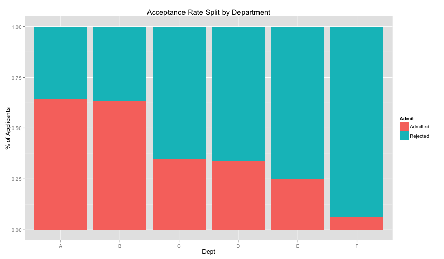

More dplyr
========================================================
author: Albert Y. Kim
date: Monday 2015/02/02


Annoucements
========================================================

* My office hours will be Monday and Wednesday 2:30-4:00
* Rich Majerus has R office hours on Thursdays 10-12 (or by appointment) in ETC 223.  Google search "Data at Reed"
* First HW will be assigned on Friday
* We'll start discussing project next week


Cheat Sheet
========================================================
Get comfortable with this: [dplyr cheat sheet](http://www.rstudio.com/wp-content/uploads/2015/01/data-wrangling-cheatsheet.pdf) from the folks at RStudio.


Last Time
========================================================
 


From Last Time: Data Needs Aggregating
========================================================

```r
tbl_df(UCB)
```

```
Source: local data frame [24 x 4]

      Admit Gender Dept Freq
1  Admitted   Male    A  512
2  Rejected   Male    A  313
3  Admitted Female    A   89
4  Rejected Female    A   19
5  Admitted   Male    B  353
6  Rejected   Male    B  207
7  Admitted Female    B   17
8  Rejected Female    B    8
9  Admitted   Male    C  120
10 Rejected   Male    C  205
..      ...    ...  ...  ...
```


From Last Time: "Collapse" over Gender
========================================================

```r
tbl_df(UCB) %>% group_by(Admit, Dept) %>% summarize(Freq=sum(Freq))
```

```
Source: local data frame [12 x 3]
Groups: Admit

      Admit Dept Freq
1  Admitted    A  601
2  Admitted    B  370
3  Admitted    C  322
4  Admitted    D  269
5  Admitted    E  147
6  Admitted    F   46
7  Rejected    A  332
8  Rejected    B  215
9  Rejected    C  596
10 Rejected    D  523
11 Rejected    E  437
12 Rejected    F  668
```


From Last Time: "Collapse" over Gender
========================================================
 


Introducing Hadley Wickham:
========================================================


Introducing Hadley Wickham
========================================================
He is the author of the following R packages

* **`ggplot`**
* **`dplyr`**
* **`lubridate`**: handling dates and times (later)
* **`stingr`**: handling character strings i.e. computer text (later)
* **rvest**: tools for webscraping (today)


rvest Package
========================================================
The rvest package works by scraping HTML code used to make webpages.  To view a webpage's raw HTML code:

* In Google Chrome: Go to menu bar -> View -> Developer -> View Source
* In Firefox: Go to menu bar -> Tools -> Web Developer -> Page Source

The `html_nodes` function looks for HTML tags.


rvest Package
========================================================
`nhl` is a [list](http://www.r-tutor.com/r-introduction/list) that contains all HTML tables on the page.


```r
webpage <- html("http://www.nhl.com")
nhl <- webpage %>%
  html_nodes("table")
```


rvest Package
========================================================
Now we pull the first table and then apply the `html_table()` function to convert it to a format useable by R.


```r
webpage <- html("http://www.nhl.com")
nhl <- webpage %>%
  html_nodes("table") %>%
  .[[1]] %>% html_table()
```


leaflet Package
========================================================
We also use the leaflet package to draw maps:  [http://www.r-bloggers.com/the-leaflet-package-for-online-mapping-in-r/](http://www.r-bloggers.com/the-leaflet-package-for-online-mapping-in-r/)


Question for Today
========================================================
Article from the Washington Post: [Colleges often give discounts to the rich. But here’s one that gave up on ‘merit aid.’](http://www.washingtonpost.com/local/education/colleges-often-give-discounts-to-the-rich-but-heres-one-that-gave-up-on-merit-aid/2014/12/29/a15a0f22-6f3c-11e4-893f-86bd390a3340_story.html)

Using the data provided, we investigate which states have the highest average no need grants (averaged over schools).

1. Create the smallest data frame (i.e. least number of rows, least number of columns) that answers this question.
2. Challenge: create a visualization of this data

Please read this article for Wednesday.


Exercise for Today
========================================================
A lot of sophisticated tools are used here, so don't try to figure out all the data preprocessing.  Focus on the `dplyr` and `ggplot`.  Some new concepts:

* Defining **functions**:  For tasks you'll be doing many times, it's a good idea to define a new function.  They take in arguments (i.e. inputs) and return outputs. Ex. on lines 64 and 71.
* **`rename()`** command in dplyr allows you to rename columns
* **`ifelse(TEST, A, B)`**:  run `TEST`, return `A` if `TRUE`, return `B` if `FALSE`.  Example `ifelse(3 <= 5, 1, 0)` returns `1`
* Missing data is stored as `NA`. `is.na(x)` tests if x is a missing value.  If you set `na.rm=TRUE` to many functions, it will ignore the missing values.  Make sure you want to do this!
