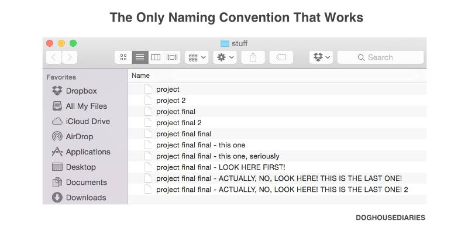
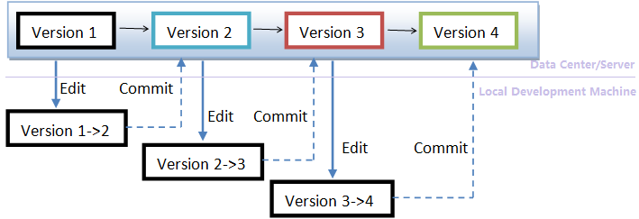

GitHub
========================================================
author: Albert Y. Kim
date: Wednesday 2015/04/15


What is GitHub?
========================================================
It is an online code repository for:

* Easy collaboration on code/data
* Backing up of files + **Version control**
* Reproducible research

It is based on the git software was created by Linus Torvald, the founder of UNIX as well.


Create Account Using an .edu Email
========================================================

If so, you can create private repositories as well.  The default is public (i.e. they want to build a open-source community).


How do you keep a history of file changes?
========================================================

The **old** model



This is easy when you have only one file.  What about 10? 100? 1000?


How do you keep a history of file changes?
========================================================

The **version control** model



You can rewind copies of an **entire directory** to past versions you know work.


Other Benefits
========================================================

* Easy to set up **reproducible research** practices: repository should contain **all** files necessary to reproduce/replicate the task in an easy to share fashion.
* Allows for multiple people to edit the same files (we won't focus on such collaboration, for you to learn on your own)
* Syncs seamlessly with RStudio.


For Example: Other People
========================================================

* [538](https://github.com/fivethirtyeight/data)
* [Fred Hutchinson Cancer Research Center Computational Biology](https://github.com/fhcrc)
* [Hadley Wickham](https://github.com/hadley?tab=repositories)
* [Forget LinkedIn, GitHub!](http://www.cnet.com/news/forget-linkedin-companies-turn-to-github-to-find-tech-talent/)


For Example: Myself
========================================================

* I use(d) it to sync files between my home and work computers so that I wouldn't have to carry a computer around.
* I use it to promo work.  For example, earlier in April I got contacted by a prof at McAllester who said he liked my work and asked me to submit a proposal to receive a NSF summer grant.
* [This class](https://github.com/rudeboybert/MATH241).  I don't post files on Moodle, but rather links to GitHub files, so if something changes, I don't need to use Moodle's awful interface to update files.


For Example: You
========================================================

* I am **requiring** that you submit your projects on your own public GitHub repository (unless your data is private).
* All in the organization [ReedCollegeMATH241](https://github.com/ReedCollegeMATH241)
* A chance to promo your work!
* Note there is a 50MB file size limit, so you might need to `.zip` certain files.
* I want a crisp README page to give a summary of your work.


Initial Setup
========================================================

* Complete [Steps 1-4](https://help.github.com/articles/set-up-git/)
* Go to my [GitHub page](https://github.com/rudeboybert) and click "Follow" on the top right.  I will add you to the [ReedCollegeMATH241](https://github.com/ReedCollegeMATH241) organization.


Creating a Repository
========================================================

From your GitHub profile page click on the Repositories Tab -> Click on "New" (in green)

* Give it the repository a name + description
* Keep it public
* Select "Initialize this repository with a README"

You now have a blank repository consisting of only a `README.md` file.  Note the "HTTPS clone URL" in the bottom right corner.


Making a Local Copy of Repository
========================================================

From RStudio

* Menu Bar -> File -> New Project -> Version Control -> Git
* In the blanks:
    + Paste the "HTTPS clone URL" from above under "Repository URL"
    + Give your project a directory name under "Project Directory Name"
    + Select where the project home folder will be
* You now have a new **local** copy of the repository, which RStudio calls a **project**.  Look at the Files panel to see where you are at.


Baby's First Commit/Push
========================================================

The first thing we'll do is add a new README file.

* Create a New File -> R Markdown
* Give it whatever name and keep the output set at HTML
* Save the file as "README.Rmd"
* In the Editor panel of README.Rmd, click the Settings gear -> Advanced -> Check "Keep Markdown File"


Quick Formatting via Markdown
========================================================

* In the Editor panel -> Arrow next to ? -> Markdown Quick Reference, in order to see what quick text formatting you can add to your .Rmd file.
* Add elements to your heart's desire, but keep the R code.
* Click on Knit HTML
* Add a bogus file to your project, like a blank txt file.


Uploading the Changes to GitHub
========================================================

Done in two steps:  a **commit** and a **push**

* In the Git panel (next to the Environment panel) check all files
* Click "commit".  This checks that your **local** changes are uploadable to the repository
* Enter a descriptive "Commit Message" (trust me, putting thought into these pays dividends later on) and click "Commit"
* Finish it all by pressing "Push"
* Refresh your repository view in your browser.  Voila!


Pulling from Repository
========================================================

Say you have the same repository set up on two machines and you want to sync the local copy on one machine with what's on GitHub.

In the "Git" panel, click "Pull".

**Note**:  If you are working between two machines and don't want to deal with overlapping changes to the same file, you have to make sure you resync at the end of every work session.  Otherwise you'll have to **merge** the conflict. (I need to learn how to do that.)


Forking Another Repository
========================================================

Say you want to make your own copy of someone else's repository for your own use.  You can **fork** their code over:

* Go to the GitHub homepage of the repository you are interested in forking.
* On the top left, click "Fork"
* You now have your own copy of the repository that you can work with, make a local copy via RStudio, etc.


Directory Structure
========================================================

* Go to the [README.Rmd](https://github.com/rudeboybert/MATH241/blob/master/README.Rmd) R Markdown file that created the homepage for this class and look under Rennie's name
* See how I load the `flights`, `weather`, etc CSV files.

```r
read.csv("./Lec06 R Markdown + HW01/flights.csv", ...)
```
* We can specify the directory the CSV file is in (i.e. we don't have to manually change the working directory).  The `./` means "this directory" and is assumed to be the home directory of your project.
* That way this code will run no matter where a user saves the project directory.

